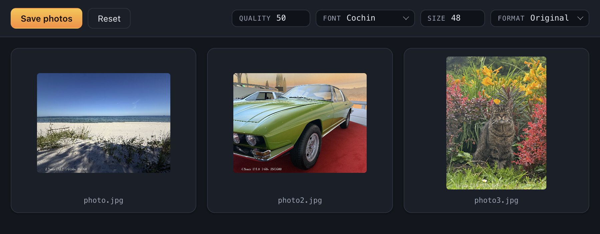
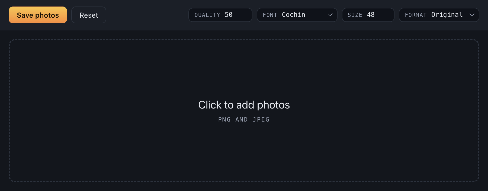

<div align="center">


</div>

# EXIF on your photo 📸

Burn your camera settings onto the photo, the way film labs used to print them.

## Preview 🎉





## Features

- 📷 Reads focal length, aperture, shutter speed and ISO straight out of the file's EXIF
- 🖋️ Prints them onto the photo in one of four serif faces (_Cochin, Baskerville, Didot, Optima_)
- 📐 Keeps the original dimensions or scales down to Full HD
- 🎚️ Caption size and JPEG quality are yours to set
- 🗂️ Takes a whole batch at once, every photo with its own preview
- 💾 Writes to a `WITH_EXIF` directory next to the originals, which stay untouched
- 🔌 Works entirely offline - nothing is uploaded, no account, no telemetry
- 🛡️ Sandboxed renderer with no access to Node.js (Electron 43)

## Requirements

macOS. The four caption faces ship with the system.

## Development

```bash
npm install
npm start
npm test
```

## License

[The MIT License](https://piecioshka.mit-license.org) @ 2026
