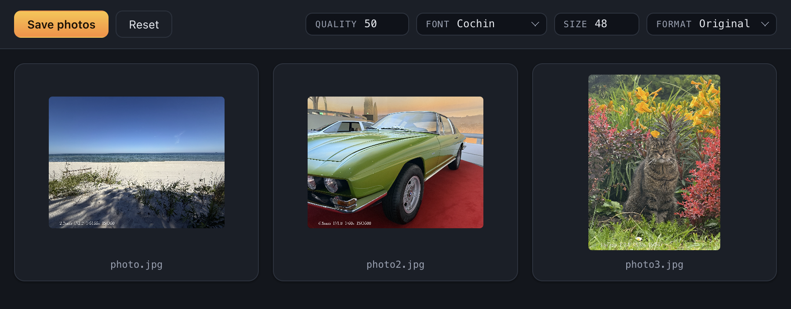
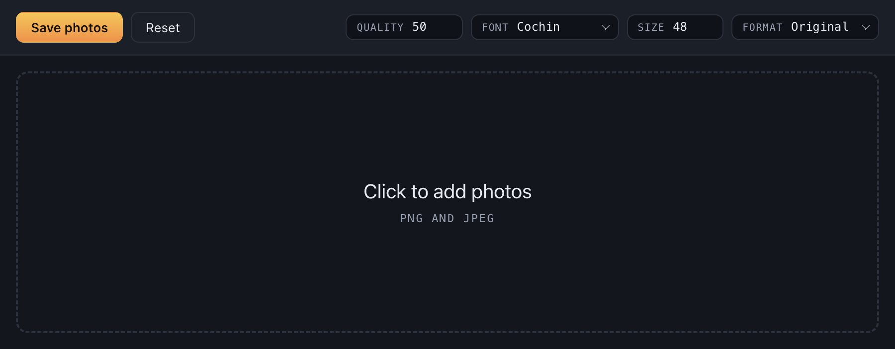

<div align="center">


</div>

# EXIF on your photo 📸

<!-- prettier-ignore-start -->

[](https://github.com/piecioshka/exif-on-your-photo/actions/workflows/ci.yml)
[](https://github.com/piecioshka/exif-on-your-photo/actions/workflows/release.yml)

<!-- prettier-ignore-end -->

Burn your camera settings onto the photo, the way film labs used to print them.

## Preview 🎉





[Watch the 30 second demo](./demo/demo.mp4) to see a batch go through every
typeface, a caption size change and a save.

## Download 📦

Grab the latest build from the [releases page](https://github.com/piecioshka/exif-on-your-photo/releases/latest).

| Platform | File                                                                                                                                                                                                                                            |
| -------- | ----------------------------------------------------------------------------------------------------------------------------------------------------------------------------------------------------------------------------------------------- |
| macOS    | [Apple silicon](https://github.com/piecioshka/exif-on-your-photo/releases/latest/download/EXIF.on.your.photo-1.0.1-arm64.dmg) · [Intel](https://github.com/piecioshka/exif-on-your-photo/releases/latest/download/EXIF.on.your.photo-1.0.1.dmg) |
| Windows  | [Installer](https://github.com/piecioshka/exif-on-your-photo/releases/latest/download/EXIF.on.your.photo.Setup.1.0.1.exe) · [Portable](https://github.com/piecioshka/exif-on-your-photo/releases/latest/download/EXIF.on.your.photo.1.0.1.exe)  |
| Linux    | [AppImage](https://github.com/piecioshka/exif-on-your-photo/releases/latest/download/EXIF.on.your.photo-1.0.1.AppImage) · [deb](https://github.com/piecioshka/exif-on-your-photo/releases/latest/download/exif-on-your-photo_1.0.1_amd64.deb)   |

> [!NOTE]
> The builds are not signed with a paid certificate. macOS needs one extra step
> on the first launch (see below), and Windows shows a SmartScreen warning,
> where "More info" reveals the "Run anyway" button.

### Opening on macOS

The macOS build is not notarized by Apple, so the first launch is blocked with a
message that the app cannot be verified. To open it once:

1. Try to open the app, then close the warning.
2. Open System Settings > Privacy & Security, scroll to Security and click
   **Open Anyway** next to EXIF on your photo.
3. Confirm with **Open**.

Or, from the Terminal, after moving the app to Applications:

```bash
xattr -dr com.apple.quarantine "/Applications/EXIF on your photo.app"
```

macOS remembers the choice, so later launches start normally.

## Features

- 📷 Reads focal length, aperture, shutter speed and ISO straight out of the file's EXIF
- 🖋️ Prints them onto the photo in one of four serif faces (_Cochin, Baskerville, Didot, Optima_)
- 📐 Keeps the original dimensions or scales down to Full HD
- 🎚️ Caption size and JPEG quality are yours to set
- 🗂️ Takes a whole batch at once, every photo with its own preview
- 💾 Writes to a `WITH_EXIF` directory next to the originals, which stay untouched
- 🔌 Works entirely offline - nothing is uploaded, no account, no telemetry
- 🛡️ Sandboxed renderer with no access to Node.js (Electron 44)

## Requirements

macOS, Windows or Linux.

The four caption faces ship with macOS. Elsewhere the system substitutes
whatever serif it has, so the captions stay readable but the lettering differs.

## Development

```bash
npm install
npm start
npm test
```

Packaging uses [electron-builder](https://www.electron.build/), one script per
platform. Each one writes to `dist/`:

```bash
npm run build:mac
npm run build:win
npm run build:linux
```

Pushing a `v*` tag builds all three on their own runners and attaches the
installers to a GitHub release.

## License

[The MIT License](https://piecioshka.mit-license.org) @ 2026
